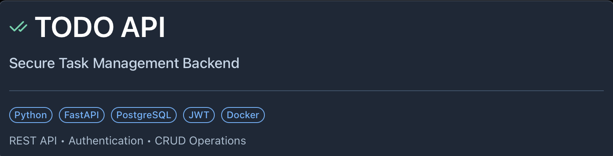
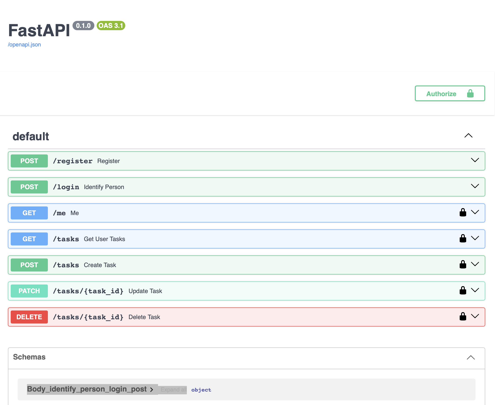

# Todo API

A RESTful backend application built with FastAPI and PostgreSQL.

The application allows users to register, authenticate using JWT tokens, and manage their personal tasks.

## Features

- User registration and authentication
- JWT-based authorization
- Secure password hashing
- Create, read, update, and delete tasks
- User-specific task management
- PostgreSQL database integration
- Docker support
- Cloud deployment with Railway

## Tech Stack

- Python 3.14
- FastAPI
- PostgreSQL
- SQLAlchemy
- Pydantic
- JWT Authentication
- Docker
- Railway


## Project Structure

```text

todo_api/
├── images/
│   ├── banner.png
│   └── swagger.png
├── routers/
│   ├── users.py
│   └── tasks.py
├── .env.example
├── .gitignore
├── .dockerignore
├── auth.py
├── database.py
├── main.py
├── models.py
├── schemas.py
├── Dockerfile
├── requirements.txt
└── README.md
```

## API Endpoints

### Authentication

| Method | Endpoint | Description |
|--------|----------|-------------|
| POST | /register | Register a new user |
| POST | /login | Authenticate and receive JWT |
| GET | /me | Get current user information |

### Tasks

| Method | Endpoint | Description |
|--------|----------|-------------|
| GET | /tasks | Retrieve user's tasks |
| POST | /tasks | Create a new task |
| PATCH | /tasks/{task_id} | Update an existing task |
| DELETE | /tasks/{task_id} | Delete a task |


## Installation

### 1. Clone the repository

```bash
git clone https://github.com/JustAndrii/todo_api.git
cd todo_api
```

### 2. Create a virtual environment

```bash
python3 -m venv .venv
source .venv/bin/activate
```

### 3. Install dependencies

```bash
pip install -r requirements.txt
```

### 4. Configure environment variables

Copy the example environment file:

```bash
cp .env.example .env
```

Update `.env` with your own PostgreSQL credentials and JWT secret key.

Make sure PostgreSQL is installed and running, and the database specified in `DATABASE_URL` exists.

### 5. Run the application

```bash
uvicorn main:app --reload
```

Open the interactive API documentation:

http://127.0.0.1:8000/docs


## Docker

The project includes a Dockerfile for containerized deployment.

The Docker image installs the required dependencies and runs the FastAPI application using Uvicorn.

Environment variables must be provided when running the container. PostgreSQL should be configured separately.

## Deployment

The application was successfully deployed on Railway using Docker and PostgreSQL.

The deployment includes:

- A Dockerized FastAPI application
- A separate PostgreSQL service
- Environment variables for database credentials and JWT configuration
- A public HTTPS domain
- Interactive API documentation via Swagger UI

Registration, authentication, and CRUD operations were tested successfully in the deployed environment.

**Note:** The public Railway services are currently stopped to avoid unnecessary hosting costs.


## Screenshots

### Swagger UI

Interactive API documentation showing all available endpoints.


